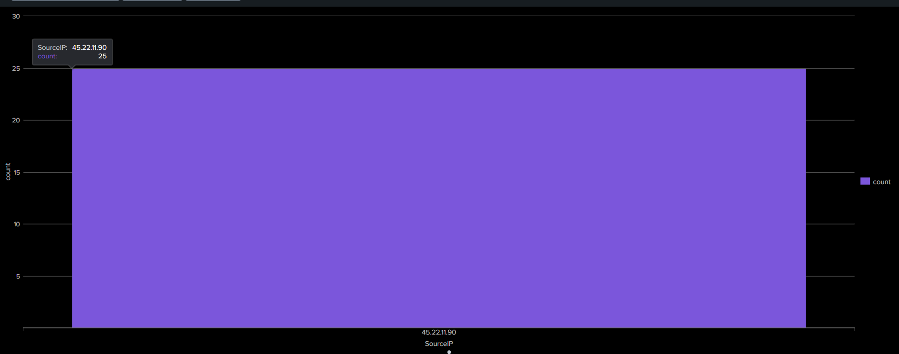

# 📸 Dashboard Screenshots

## 🚨 Brute Force Detection Dashboard

This dashboard visualizes failed login attempts detected from Windows Security Logs in Splunk.

### Detection Highlights
- Multiple failed login attempts detected
- Suspicious attacker IP identified
- Real-time brute-force monitoring
- SOC investigation support



---

# 📊 Additional Dashboard Panels

## 👤 Top Targeted Users

This panel identifies the most targeted accounts during brute-force attacks.

```spl
index="demo_log" sourcetype="csv" EventCode="4625"
| stats count by AccountName
| sort - count
